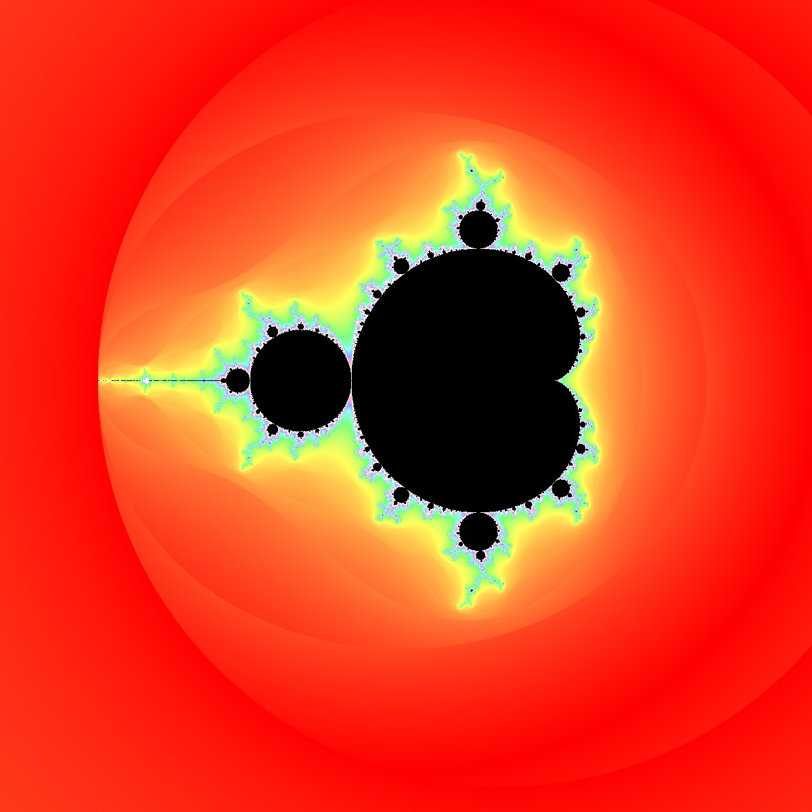
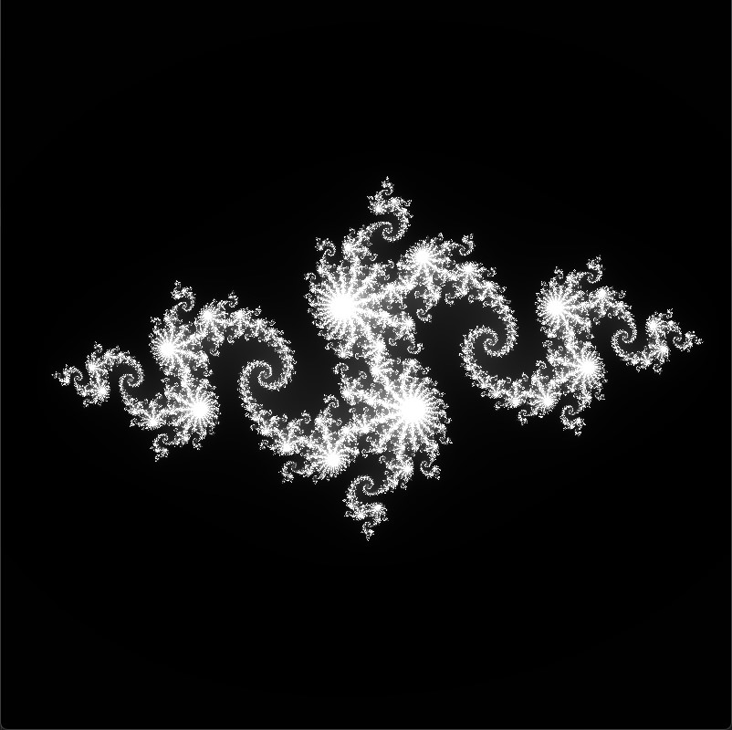
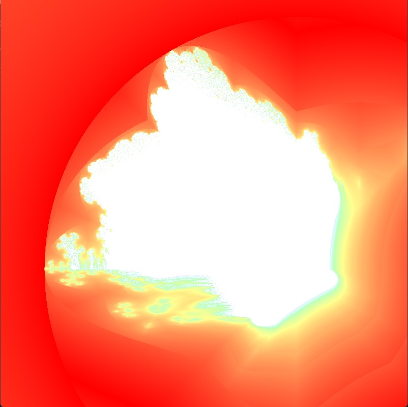
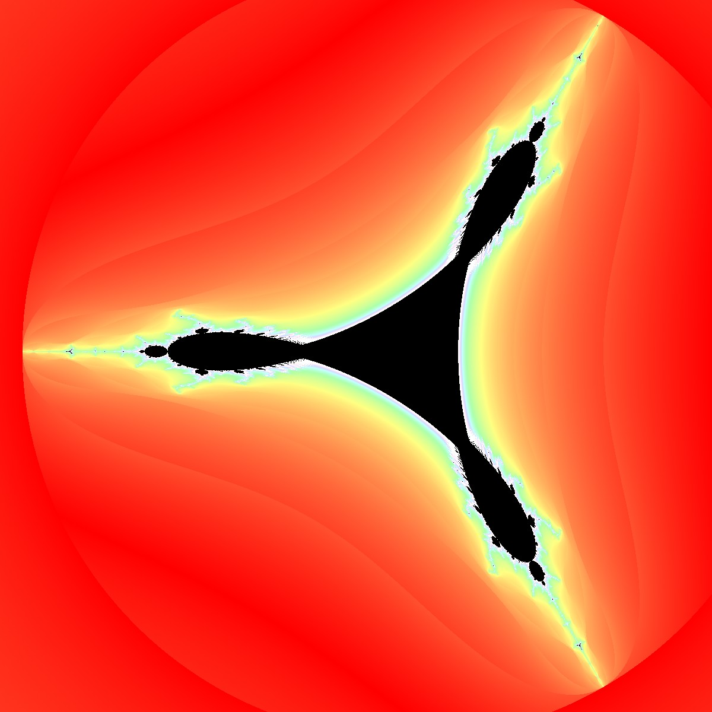

# Fractal
This Application allows you to view different kinds of fractals.
You can zoom and move the view as close as you want since we use double precision

### Controls:
#### Move: ```Mouse Left```
#### Zoom: ```Mouse wheel```
#### Increase maximum iterations: ```A```
#### Decrease maximum iterations: ```D```
#### Set Colorizer:
- Gray: ```7```
- Blue: ```8```
- Colorful: ```9```

### Outputs:
#### Mandelbrot (Colorful): Press: ```1```

#### Julia (Grey): Press: ```2```

#### Burning ship (Colorful): Press: ```3```

#### Tricorn (Colorful): Press: ```4```

